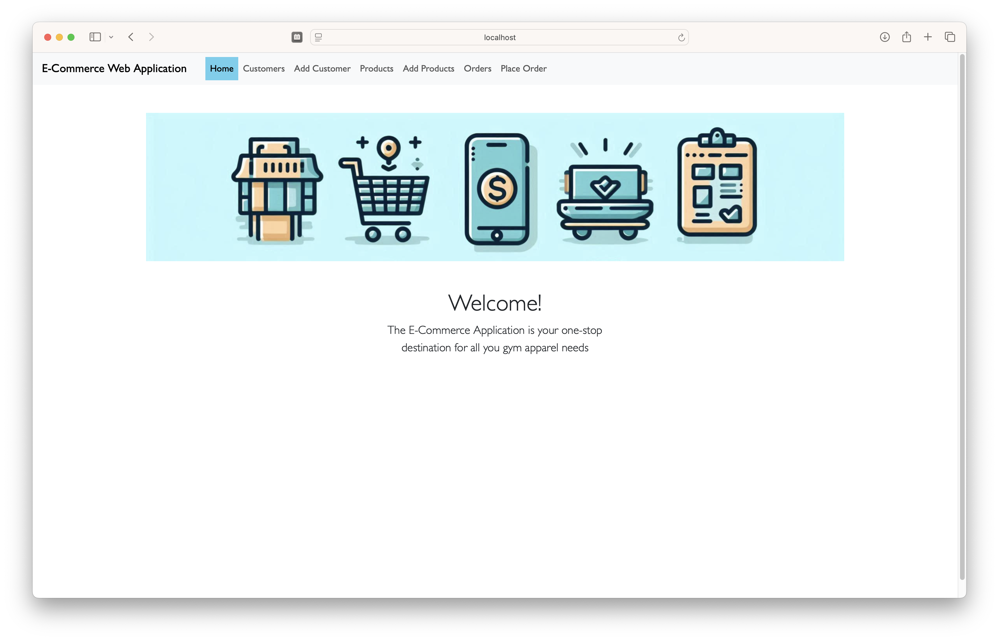
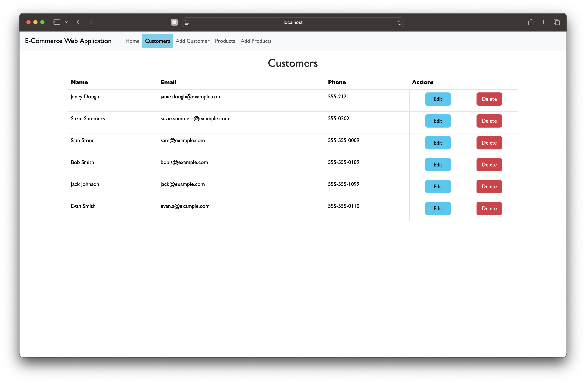
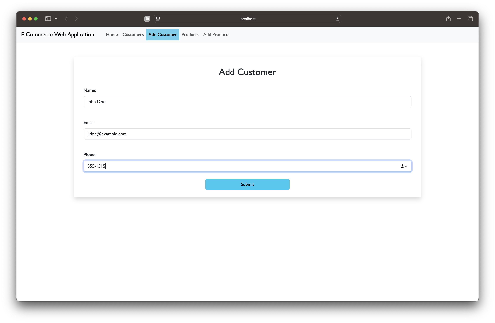
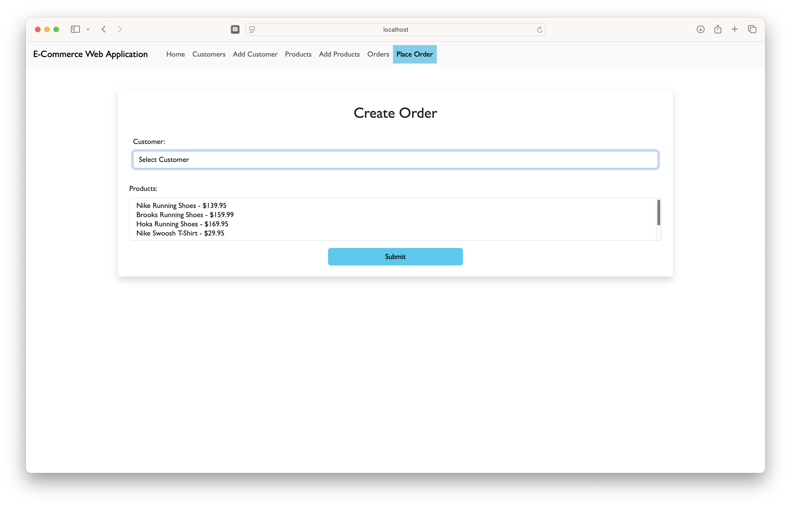

# React E-Commerce Web Application

The React E-Commerce Web Application is a simple application that allows a user to access Customer, Product, and Order information.  It is an extension of a previous project that was built using Flask and now utilizes Axios to pull information from a database, rather than Postman.  Bootstrap has also been integrated for styling.  

## Installation

This is the front end of [Module 6 - E-Commerce API](https://github.com/jessicaanne0982/Module6_MiniProject_ECommerce_API).


1. Clone this repository: 
```bash
git clone https://github.com/jessicaanne0982/Module11_Project_React_Ecommerce_App
```
2. Within the terminal, navigate to the e-commerce-web-app directory: 
```bash
cd e-commerce-web-app
```
3. Install the required dependency:
```bash
npm install
```
4. Run the application in development mode: 
```bash
npm run dev
```

5. Open [http://localhost:5173/](http://localhost:5173/) to view the application in the browser.

### *** NOTE ***
You must have [Module 6 Project E-Commerce API](https://github.com/jessicaanne0982/Module6_MiniProject_ECommerce_API) running before running this front end application!


## Usage


The Home Page greets the user


The Customer page offers the user a view of all the customers' names as well as their email and phone and allows the user to either 'Edit' or 'Delete' the customer.  

[screenshot of Edit Customer]
Clicking on the 'Edit' button navigates the user to the 'Edit-Customer' page where the selected customer's information is pre-populated in the form for easy updating.


The Add Customer link allows to user to easily add a new customer to the database.

The links for Products and Add Product work the same as the aforementioned Customer and Add Customer pages.

 
The Order form allows the user to select one customer from a drop down select box.  Below, there is another select box displaying the products available.  The user can select as many product as he or she would like.  Pressing submit pushes the order to the database and will display within the table on the Orders List page.


## GitHub Link

[Module 6 Project - GitHub Link](https://github.com/jessicaanne0982/Module6_MiniProject_ECommerce_API)

[Module 11 Project - GitHub Link](https://github.com/jessicaanne0982/Module11_Project_React_Ecommerce_App)